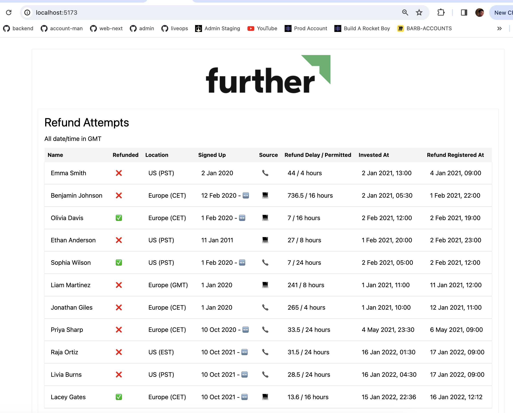
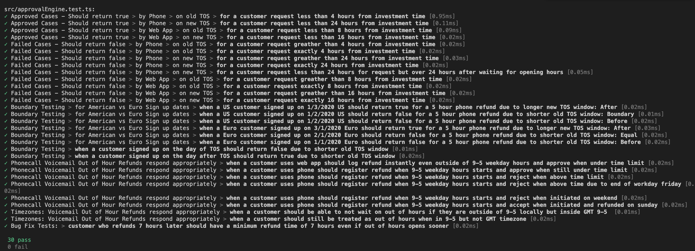

## Bun + React + TypeScript + Vite

`bun install`

`bun dev`

I've used Bun instead of Node as I've been planning to test it out for a while on any new project I started. It is very quick but functionally seemed no different to node.

## Code Test

Spent a bit more than 2 hours on this but wrote a lot of tests that may have been overkill for the table that needed to be shown.

I believe all of the table rows are correctly marked as Refundable or Not.

## Frontend

## Tests

## Changes or Refactoring

If I was to spend more time on this, I would find a more sophisticated way of converting dates between timezones. While this works for the data set in use, if there was a British Summer Time or Daylight Savings edge case- my solution would not handle that boundary properly.
